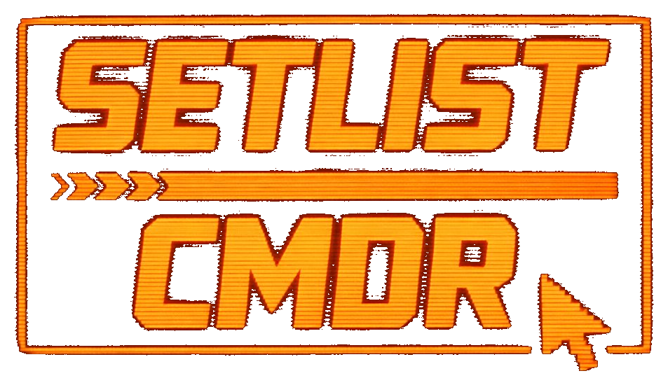

<div align="center">

</div>

# Setlist CMDR

A band setlist and song management system that runs on your local network. No internet required at the venue. Run it on a Raspberry Pi, connect all devices to the same WiFi, and everyone opens a browser. Nothing to install on phones or tablets.

---

## What it does

The band leader controls everything from a PIN-protected web interface. Musicians open a separate page on their own devices and see the current song in real time. A confidence monitor page is available for a floor wedge or large display. All screens stay in sync over WebSocket with no polling or page refreshes.

---

## Features

**Song library**
Store your entire repertoire. Each song holds a title, artist, key, capo, tempo, duration, status, lyrics, chords in ChordPro format, and notes. Search by title or artist. Filter by status. Four status levels: Active, Needs Work, Maybe, and Retired.

**Capo** is a first-class field. When set, all chord displays show the fingered shapes (what the guitarist actually plays) rather than the sounding pitch. A song in B with Capo 2 shows G-shape chords. The per-device transpose control applies on top of the capo offset.

**ChordPro chord editor**
Chords are stored using ChordPro notation with chord names in square brackets inline with lyrics. The song editor includes a fullscreen side-by-side editor with a live preview that updates as you type. Toggle between Lyrics and Chords view in the preview before saving. Press Escape or click Done to write back to the form.

A Convert button inside the editor accepts the common chords-above-lyrics format used by Ultimate Guitar and most plain-text chord sheets, and converts it to ChordPro automatically.

**CSV import**
Bulk-import songs from a spreadsheet. Download a template from the Songs toolbar to get the correct column format. Upload your CSV, map each column to the correct field using the column mapper, review the first few rows, and import. Supported fields: Title, Artist, Key, Tempo, Duration, and Status. Lyrics, chords, and notes must be added per song after import.

**Setlists**
Create and manage multiple setlists. Add songs from your library, drag to reorder, insert section labels between songs such as Opener or Slow Set, and see a running total duration. Rename by clicking the title. Clone any setlist as a starting point. Mark setlists Active or Inactive. Inactive setlists are hidden from the Live Control dropdown. The setlist list itself can be reordered by dragging.

**Live Control**
Select an active setlist and click Engage. All connected musician screens update instantly. Navigate with Prev and Next, or click any song in the queue to jump directly. Each musician sees the current song title, key, tempo, and a next-song ribbon. End the show with Stand Down to return all screens to standby.

**Rehearsal mode**
Click Rehearse on any song in the Songs tab to push that song to all musician screens without starting a live show. The leader is taken directly to the Live Control stage view. Musicians see a blue Rehearsal banner at the top of their screen. End with the End Rehearsal button in the control bar.

**Confidence monitor**
A dedicated full-screen display page at `/monitor` designed for a floor wedge or large display viewed from several feet away. Shows the current song title and key in very large type, followed by the full lyrics or chords, with a Next ribbon at the bottom. The monitor tracks the leader's scroll position in real time and reflects transpose changes immediately. No controls, no header chrome.

URL parameters for the monitor:

| Parameter | Values | Effect |
|---|---|---|
| `mode` | `lyrics` (default), `chords` | Which view to show |
| `fontscale` | e.g. `0.9`, `1.3` | Scale the base font size |
| `portrait` | `1` | Portrait layout for a rotated display |
| `fit` | `1` | Compact layout with auto-fit font scaling |
| `cols` | `1` | Two-column layout |
| `hc` | `1` | High contrast mode |

Example: `http://192.168.1.100:8000/monitor?mode=chords&fit=1&cols=1`

In fit mode, the layout is maximally compacted and the font is automatically scaled down until all content fits on screen, stopping at a minimum legible size. Combine with `cols=1` for the best chance of fitting a full song on one screen.

**Synced flash metronome**
The leader starts the metronome and all connected devices flash in phase. Sync is achieved via an NTP-style clock calibration over WebSocket: each device exchanges 16 round-trip timestamps with the server on connect, discards the 8 with the worst round-trip times, and averages the rest to compute a precise clock offset. Re-syncs every 30 seconds with drift clamped to 20ms per cycle to avoid phase jumps mid-performance.

Scheduling uses the Web Audio API where available, which runs in a separate thread immune to main-thread jank and background tab throttling. A date-based fallback handles cases where the audio context cannot be resumed. A radial amber overlay pulses at tempo with a brighter accent on beat 1. Auto-stops after a configurable timeout of 10, 15, 20, or 30 seconds.

**Signal messages**
Send one-tap text alerts to all musician screens during a live show or rehearsal. Eight configurable slots mapped to F1 through F8 keyboard hotkeys. Default signals: RUSHING, DRAGGING, CHORUS, BRIDGE, KEEP GOING, WRAP IT UP, HOLD HERE, EYES ON ME. Labels are editable and saved per device. A large amber banner slides down on every musician screen and dismisses after 3 seconds.

**Bluetooth page turner pedal**
Pair any Bluetooth page turner with the leader device and assign its keys in Settings. Default mapping is Right Arrow for next song and Left Arrow for previous. Four actions can be assigned independently: Next Song, Prev Song, Scroll Down, and Scroll Up. Three built-in presets cover the most common pedal brands. Scroll Down and Scroll Up move the content area 80% of its visible height per press.

**Per-musician controls**
Each musician independently controls: Lyrics/Chords view toggle, font size slider, line spacing (Normal/Tight/Loose), two-column layout, high contrast mode, transpose up or down by up to 11 semitones, and autoscroll. All preferences are saved per device. The band leader has the same controls in their stage view, including the two-column toggle.

**Compact stage mode (leader)**
A ⊡ button in the live control bar collapses all chrome to minimum height, maximising the content area. Saved across sessions.

**Musician roster**
The leader sees a live count of connected musicians in the nav bar. Clicking it opens a popup showing each musician by name. The roster updates in real time.

**PIN-protected leader interface**
The leader page requires a PIN to access. The default PIN is `1234`. Change it on first login via Settings. Sessions last 24 hours and are stored in the browser. All state-changing operations require authentication. The musician page and monitor page are open without a PIN.

**Band member roster**
The leader manages a named list of band members from the Crew modal. These names appear as tap-to-join buttons on the musician name screen, so each person connects with one tap. Names are stored in the database. A freeform text input remains for guests.

**Live state persistence**
The current setlist, song index, and live status are written to the database on every change. If the server restarts mid-show, clients reconnecting receive the current state immediately with no manual recovery needed.

**Database backup and restore**
Download the live SQLite database directly from the leader nav bar. The file is timestamped automatically. Upload a backup to restore it. The server validates the file before replacing anything and automatically saves the current database before overwriting.

**Font caching**
By default the app loads fonts from Google Fonts. Run `bash setup-fonts.sh` once while the Pi has internet access to download and cache all fonts locally. After restarting the server, fonts load from the Pi with no external dependency. Falls back to Google Fonts automatically if the cache does not exist.

**iPad and Desktop modes**
A toggle in the nav bar switches between iPad mode and Desktop mode. iPad mode uses larger touch targets, bigger fonts, and press feedback instead of hover states. Desktop mode is compact and mouse-optimized. Defaults to iPad mode. Saved per device.

**Progressive Web App**
The leader page and musician page can each be installed to the home screen on iPad, iPhone, and Android. Each has its own manifest so the installed icon opens the correct URL. Launches full-screen with no browser chrome.

---

## Running on your PC

Requires Python 3.9 or newer. Works on Windows, macOS, and Linux.

**Windows:** double-click `start.bat`, or from a terminal:
```
python run.py
```

**macOS and Linux:**
```bash
python3 run.py
```

On first run, `run.py` creates a virtual environment, installs all dependencies, starts the server, and opens the leader view in your browser. Subsequent runs skip the install step.

```bash
python run.py --port 8080     # use a different port
python run.py --no-browser    # skip auto-opening the browser
```

To test with multiple musicians, open additional browser tabs at `http://localhost:8000/` and enter a different name in each.

The database (`setlist.db`) is created in the project folder on first run and carries over when you move the folder to the Pi.

---

## Deploying to Raspberry Pi

**Requirements:**
- Raspberry Pi 3B+ or newer
- Raspberry Pi OS 64-bit (Bookworm or Trixie)
- Python 3.9 or newer
- All devices on the same network

**Setup:**
```bash
cd setlist-cmdr
bash setup.sh
```

This creates the virtual environment, installs dependencies, and registers a systemd service that starts Setlist CMDR automatically on every boot.

**Finding the Pi IP address:**
```bash
hostname -I
```

Open the leader interface at `http://<pi-ip>:8000/leader` and the musician page at `http://<pi-ip>:8000/`.

---

## Confidence monitor setup

Open `http://<pi-ip>:8000/monitor` on any browser connected to the same network.

For a dedicated floor wedge Pi running Chromium in kiosk mode, add a file at `/etc/xdg/autostart/monitor.desktop`:

```
[Desktop Entry]
Type=Application
Name=Monitor
Exec=chromium-browser --kiosk --noerrdialogs --disable-infobars http://<main-pi-ip>:8000/monitor
```

The monitor Pi needs no server of its own. It just opens a browser pointed at the main Pi.

Add URL parameters to the kiosk URL to configure the display. For example, fit mode with two-column chords view:

```
Exec=chromium-browser --kiosk --noerrdialogs --disable-infobars \
  "http://<main-pi-ip>:8000/monitor?mode=chords&fit=1&cols=1"
```

---

## First login

The default leader PIN is `1234`. After logging in:

1. Click **Settings** in the nav bar
2. Enter a new PIN and click Save
3. You will be logged out and prompted to log in again with the new PIN

To lock the leader page without closing the browser, click **Settings** then **Lock / Log Out**.

---

## Setting up band members

1. Click **Crew** in the nav bar
2. Type a name and press Enter or click Add
3. Repeat for each band member

Members appear as large tap buttons on the musician name screen. Remove a member by clicking the X next to their name in the Crew modal.

---

## Bluetooth pedal setup

1. Pair the pedal with the device running the leader page via Bluetooth in OS settings
2. Open **Settings** in the nav bar and scroll to Bluetooth Page Turner Pedal
3. Click a field and press the pedal button to assign it
4. Repeat for each button

Three presets handle the most common configurations: Arrow keys (AirTurn, PageFlip, Donner), Page Up/Down (iRig BlueTurn), and bracket keys. Scroll Down and Scroll Up are unassigned by default since most pedals have two buttons. If you have a four-button pedal, assign all four independently.

---

## Installing as a PWA

**iPad or iPhone (Safari only):**
1. Open the correct URL in Safari
2. Tap the Share button
3. Tap Add to Home Screen
4. Tap Add

**Android (Chrome):**
1. Open the URL in Chrome
2. Tap the three-dot menu
3. Tap Add to Home Screen

The leader page and musician page install separately. Each person installs whichever applies to them.

---

## Band leader workflow

1. Open `http://<pi-ip>:8000/leader` and log in
2. Go to **Songs** and build your library. Set tempo and key so the metronome and transpose work correctly
3. Go to **Setlists** and create a setlist for the show. Add songs, drag to reorder, add section labels
4. Mark setlists you are not using as Inactive
5. Go to **Live Control**, select your setlist, and click **Engage**
6. Use Prev and Next to navigate, or click any song in the queue. Use the signal bar or F1 through F8 to send messages. Click Flash to start the synced metronome

---

## Rehearsal workflow

1. Go to **Songs**
2. Click **Rehearse** on any song
3. The leader view switches to the full stage immediately and all musician screens show the song with a blue Rehearsal banner
4. Click **End Rehearsal** in the control bar when done

---

## Musician workflow

1. Connect to the same network as the Pi
2. Open `http://<pi-ip>:8000/` in a browser
3. Tap your name from the crew buttons, or type a name and tap Join
4. Wait on the Standby screen until the leader engages a show or starts a rehearsal
5. Use the controls bar to adjust: LYRICS/CHORDS toggle, font size, line spacing (≡), two-column layout (⫴), high contrast (◐), transpose (♭/♯), and AUTO scroll. All settings are saved per device.
6. Tap anywhere in the content area to hide the controls bar and maximise reading space. Tap again to bring it back.

---

## ChordPro format

Wrap chord names in square brackets before the syllable where they are played:

```
[G]Here comes the [Em]sun, [C]doo-doo-doo-[D]doo
[G]Here comes the [Em]sun, and I [C]say it's all-[D]right
```

Chords are shown on their own line above the lyric in the traditional lead-sheet layout. Lyrics view strips all chord markers and shows clean text only. Each device transposes independently.

**Section markers** use the same bracket syntax but contain a section name rather than a chord. Any token that is not a valid chord name is treated as a section marker:

```
[Verse 1]
[G]Here comes the [Em]sun

[Chorus]
[C]Come [G]together [D]right now

[Verse 2]
[G]He wear no shoeshine

[Chorus]
```

The second `[Chorus]` with no content following it is a back-reference. It renders as a dimmed repeat cue showing the chorus content at reduced opacity, rather than duplicating the full text. This keeps long songs compact while keeping the structure visible.

Section headers render in amber with a ruled divider, making them easy to spot while scanning.

**The Convert tool** in the fullscreen chord editor accepts the standard chords-above-lyrics format used by Ultimate Guitar and most plain-text chord sheets:

```
G           Em          C      D
Here comes the sun, doo doo doo doo
```

Paste it in, click Convert to ChordPro, and the chord positions are mapped to the lyric text automatically.

---

## CSV import

1. Click **Template** in the Songs toolbar to download an example file
2. Fill in your songs and save as CSV
3. Click **CSV** in the toolbar and select your file
4. Map each column to the correct field
5. Review the preview and click Import

Lyrics, chords, and notes are not supported by the importer and must be entered per song afterward.

**Supported fields:**

| Field | Notes |
|---|---|
| Title | Required |
| Artist | Optional |
| Key | Optional, e.g. G, Am, Bb |
| Tempo | Optional, integer BPM |
| Duration | Optional, integer seconds or MM:SS |
| Status | Optional: active, needs_work, maybe, retired |

---

## Database backup and restore

**From the browser:**
Download: click the **DB** button in the leader nav bar. The file is named with a timestamp.
Restore: click the upload **DB** button, select a `.db` file, and confirm. The server validates it, saves a backup of the current database, and reloads.

**On the Pi:**
```bash
# Backup
cp setlist.db setlist-$(date +%Y%m%d).db

# Restore
sudo systemctl stop setlist-cmdr
cp setlist-YYYYMMDD.db setlist.db
sudo systemctl start setlist-cmdr
```

---

## Font caching for offline use

```bash
bash setup-fonts.sh
sudo systemctl restart setlist-cmdr
```

Downloads Bebas Neue, DM Mono, and DM Sans from Google Fonts and stores them in `static/fonts/`. After restarting, all fonts load from the Pi with no internet required. The app falls back to Google Fonts automatically if the cache does not exist.

---

## Song status values

| Status | Meaning |
|---|---|
| Active | Ready to perform |
| Needs Work | Still learning or not gig-ready |
| Maybe | Possible addition to repertoire |
| Retired | Dropped from active use |

---

## Service management (Pi)

```bash
sudo systemctl status  setlist-cmdr
sudo systemctl restart setlist-cmdr
sudo systemctl stop    setlist-cmdr
sudo journalctl -u     setlist-cmdr -f
```

---

## File structure

```
setlist-cmdr/
├── main.py                    FastAPI server, all endpoints and WebSocket
├── run.py                     Cross-platform launcher
├── requirements.txt           Python dependencies
├── setlist.db                 SQLite database, auto-created on first run
├── setup.sh                   First-time Pi setup
├── setup-fonts.sh             Optional font cache setup
├── start.bat                  Windows quick-start
├── start.sh                   Linux and macOS quick-start
└── static/
    ├── leader.html            Band leader interface
    ├── leader.css             Leader styles
    ├── musician.html          Musician stage view
    ├── monitor.html           Confidence monitor display
    ├── sw.js                  PWA service worker
    ├── manifest-leader.json   PWA manifest for leader
    ├── manifest-musician.json PWA manifest for musicians
    ├── fonts/                 Locally cached fonts (after setup-fonts.sh)
    └── img/
        ├── logo_large.png
        ├── logo_bottom_right_wide.png
        ├── logo_top_right.png
        ├── logo_bottom_left.png
        ├── icon-192.png
        ├── icon-512.png
        └── apple-touch-icon.png
```
