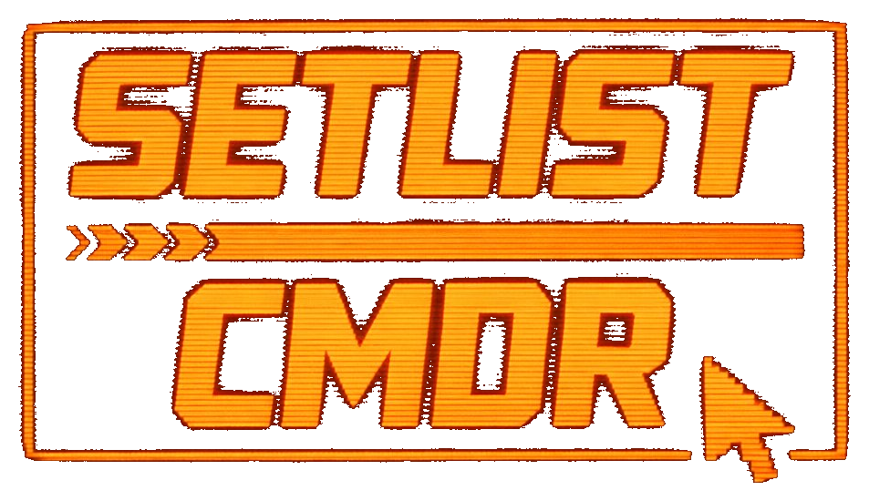

<div align="center">

</div>

# Setlist CMDR

A band setlist and song management system that runs on your local network. No internet required at the venue. Run it on a Raspberry Pi, connect all devices to the same WiFi, and everyone opens a browser. Nothing to install on phones or tablets.

The band leader controls everything from a PIN-protected web interface. Musicians see the current song in real time on their own devices. Confidence monitors are available for a floor wedge or large TV, and each one can be set up and named independently.

---

## Quick start

**Windows:** double-click start.bat

**macOS and Linux:**
```bash
python3 run.py
```

On first run, a virtual environment is created, dependencies are installed, and the leader view opens in your browser. The default PIN is 1234.

Musicians open http://your-ip:8000/ on any device connected to the same network.

---

## What each role sees

**Band leader** (http://your-ip:8000/leader)
Full control: song library, setlists, live navigation, rehearsal mode, signals, metronome, monitor settings. PIN protected.

**Musicians** (http://your-ip:8000/)
Stage view showing the current song. Each musician independently controls their view mode, font size, transpose, capo compensation, autoscroll speed, and line spacing. All preferences are saved per device. Transpose is remembered per song, so a chart you always play a step down comes back transposed. The screen is kept awake while a song is showing, and a clear warning appears if the device loses contact with the leader mid-show. A section-jump button lets a player skip straight to the Bridge or Chorus.

**Confidence monitor** (http://your-ip:8000/monitor)
Full-screen display for a floor wedge or large TV. Tracks the leader scroll position and transpose in real time. You can run more than one monitor at the same time, each with its own name and its own independent settings (mode, capo, rotation, layout), so a monitor at stage left can be configured differently from one at stage right. See Confidence monitor below for details.

---

## Song library

Each song stores: title, artist, key, capo, time signature, tempo, duration, status, a combined Lyrics & Chords field (ChordPro), and notes.

**Status levels:** Active, Needs Work, Maybe, Retired. Search matches title, artist, lyrics, and chords. Filter by status.

**Capo** is a first-class field. Chord displays show fingered shapes adjusted for the capo position. Each device has a CAPO toggle to turn this off for players who are not using one.

**Key** supports both sharp and flat spellings, such as C#, Db, F#, Gb, Bb, and Eb, in major and minor. A "Detect" button next to the field scans the Lyrics & Chords content and suggests the key from the first and most frequent chord root. It sets the field but never overwrites without you clicking it.

**Time signature** options are 4/4, 3/4, 2/4, 5/4, 6/8, and 12/8. The metronome uses the correct beats per bar for each song automatically.

**ChordPro format** stores chord names inline with lyrics using square brackets, in a single combined Lyrics & Chords field. Paste a whole chart in at once rather than filling separate boxes. The song editor includes a fullscreen split editor with live preview, a chord insert toolbar, and a Convert tool that accepts the chords-above-lyrics format used by Ultimate Guitar and most plain-text chord sheets.

**Standard ChordPro directives** are also recognized, so charts written for other ChordPro tools render correctly. Curly-brace section directives (`{start_of_chorus}`, `{soc}`, `{start_of_verse}`, `{start_of_bridge}`, with optional labels like `{start_of_verse: Verse 2}`) are treated the same as the bracket sections described below, and matching `{end_of_...}` markers are recognized. Inline annotations such as `{comment: ...}` (and `{c:}`, `{ci:}` for italic, `{cb:}` for boxed) render as highlighted cue lines in the chart on every screen. Metadata directives (`{title}`, `{artist}`, `{key}`, `{tempo}`, `{capo}`, `{time}`, `{duration}`) are pulled into the matching song fields automatically when a file is imported.

**Section markers** use the same bracket syntax as chords. Any token that is not a chord name becomes a section header: [Verse 1], [Chorus], [Bridge], and so on. Section headers appear in all view modes including Lyrics. A bare repeat reference, such as a second [Chorus] with no following content, renders as a dimmed cue rather than duplicating the text.

---

## Song editor

Click any song card to open the song editor modal, or click + New Song to create one.

**TAP button.** Next to the BPM field. Tap it in time to set tempo by feel. Shows the calculated BPM on the button while tapping and writes it to the tempo field. Resets after 3 seconds of inactivity.

**Detect button.** Next to the Key field. Scans the Lyrics & Chords content and suggests a key. See the Key entry above for details.

**Duplicate title warning.** If you type a title that matches an existing song, an amber warning appears beneath the field when you tab away. This does not block saving, since you may genuinely want two versions of the same song in different keys.

---

## ChordPro editor

The fullscreen ChordPro editor opens in Chords mode with a two-row toolbar above the text area.

**Sections row.** Tap any section name to insert it at the cursor: Intro, Verse 1, Verse 2, Verse 3, Pre-Chorus, Chorus, Bridge, Outro, Tag, Solo.

**Chords row.** Horizontally scrollable. Contains:
- Left and right nudge arrows to move the nearest chord one character at a time
- All 7 natural chords (C D E F G A B)
- All 7 minor chords (Am Dm Em Gm Bm Cm Fm)
- Common accidentals (Bb Eb Ab Db F# C# Gb)
- Modifiers that append to the nearest chord: +7, maj7, m7, sus2, sus4, add9

Switch to Lyrics mode to hide the toolbar and write plain text without chord syntax. The Convert tool converts chords-above-lyrics format to ChordPro automatically.

---

## View modes

The view mode button on each device cycles through five options.

**Chords.** Chord-above-lyric layout, the default.
**Lyrics.** Plain text with section markers, no chord notation.
**Consol.** All section headers shown in order, with duplicate section content omitted (repeated sections show a "(repeat)" cue instead of the full lyrics again).
**Melody.** Chord names and section markers only, no lyric text.
**Nash.** Nashville Number System. Chords are shown as scale-degree numbers, 1 through 7, relative to the song's Key field, with quality suffixes kept as written (Gmaj7 in the key of C becomes 5maj7) and off-scale roots marked with an accidental (b2, b3, #4, b6, b7). This requires the song's Key field to be set; without a key, chords display unchanged. Numbering is always relative to the key's major scale regardless of whether the song itself is major or minor, which is a standard simplification, since some minor-key charts use a different convention. On the confidence monitor, Nash mode is set from the monitor setup page or the leader's monitor panel, since the monitor has no cycle button of its own.

---

## Setlists

Create multiple setlists, add songs from the library, reorder by dragging (this works with touch on an iPad), and insert section labels between songs. Songs within a setlist are also reordered by dragging the handle on each row. Running duration updates as you build. Clone any setlist as a starting point. The Active and Inactive toggle lets you hide setlists you are not currently using.

To add a song to the current setlist without leaving the Songs tab, click the + Set button on any song card.

---

## Live show workflow

1. Go to Live Control, select a setlist, click Engage.
2. All musician screens update immediately.
3. Navigate with Prev and Next, or click any song in the queue to jump.
4. Use the signal bar (or F1 through F8) to send text alerts to all musicians.
5. Use TAP to set BPM by tapping in tempo, then FLASH to start the synced metronome.
6. End the show with End.

---

## Rehearsal mode

Click Rehearse on any song in the Songs tab to push it to all musician screens without starting a live show. Musicians see a teal Rehearsal banner. End with End Rehearsal.

---

## Metronome

The leader starts the metronome and all connected devices flash in phase. When it starts, a GET READY overlay appears while the clock sync settles. After one full bar, beat numbers pulse on screen on every device simultaneously. Beat 1 is brighter. Time signature is read from the current song, so 3/4 cycles 1-2-3 and 6/8 cycles 1-2-3-4-5-6.

Auto-stops after a configurable timeout of 5, 7, or 10 seconds.

---

## Signal messages

Eight configurable one-tap alerts: RUSHING, DRAGGING, CHORUS, BRIDGE, KEEP GOING, WRAP IT UP, HOLD HERE, EYES ON ME. Labels are editable. A large amber banner appears on all musician screens for 3 seconds. F1 through F8 are hotkeys on the leader.

---

## Confidence monitor

The monitor at /monitor shows the song title, key, BPM, and time signature in large type, followed by the full content, with a Next ribbon at the bottom.

**Multiple monitors.** Each physical monitor (each browser or kiosk display running /monitor) gets its own persistent identity the first time it loads the page. Settings such as view mode, capo compensation, rotation, columns, and font scale are stored per monitor, not shared globally, so a monitor at stage left can run in Nashville numbers while one at stage right stays in plain Chords mode. Give each one a name, such as "Stage Left" or "FOH," so you can tell them apart when configuring.

**Configuring a monitor, three ways without touching the TV:**

1. Read the setup URL shown on that monitor's own standby screen and open it on your phone. The URL already targets that specific monitor and shows the Pi's actual LAN address, so it works from any device on the network.
2. Open Settings in the leader nav bar and use the Confidence Monitor section. A dropdown lists every monitor that has ever connected, showing whether it is currently online. Pick one to load and edit its settings, or use the small X button next to the dropdown to forget a monitor you no longer use, such as one left over from a device that was replaced or reset.
3. Open http://your-ip:8000/monitor/setup directly and pick a monitor from the list there.

**Available settings per monitor:** view mode (Chords, Lyrics, Consol, Melody, Nash), two columns, fit mode, high contrast, capo compensation, font scale, portrait (hardware rotation), rotate 90 degrees clockwise or counterclockwise (software rotation), and a display name.

**Rotate 90 degrees** uses a CSS transform to rotate the browser content, clockwise or counterclockwise, without changing any TV or OS settings. Use this when the TV is physically in landscape but needs to display portrait content, or when the screen is mounted in a fixed orientation you cannot change.

---

## Bluetooth page turner pedals

**Leader:** Pair via Bluetooth, assign keys in Settings. Actions: Next Song, Prev Song, Scroll Down, Scroll Up, Toggle View Mode, Toggle Autoscroll. Presets for Arrow keys, Page Up/Down, and bracket keys. Presets only bind the two navigation keys; the scroll, mode, and autoscroll actions are left unbound so you can assign them by hand if your pedal has more than two switches.

**Musicians:** Tap the gear button in the header. Actions: Scroll Down, Scroll Up, Toggle View Mode, Toggle Autoscroll. Presets for Arrow keys and Page Up/Down.

---

## Importing songs

**Single file:** Click Import in the Songs toolbar. Supported formats are .txt, .chopro, .cho, .crd, .chordpro, .pro, and .pdf (born-digital only; scanned or image PDFs have no extractable text). A review modal opens before the song is created, showing any ChordPro metadata it detected.

PDF support depends on the optional `pdfplumber` package, which both `run.py` and `setup.sh` try to install automatically alongside the required dependencies. On a machine where that install fails, most commonly macOS without Homebrew's OpenSSL and pkg-config, the app still runs normally. Every other import format and all core features work without it, but .pdf import returns a clear error until pdfplumber is installed by hand with `pip install pdfplumber` (see the comments in requirements.txt for the macOS fix if that fails too).

**Batch import:** Click Batch and select a zip file. Every supported file in the zip imports directly with duplicate detection. A results panel shows what was imported and what was skipped, and flags any song where the title had to be guessed, no key was detected, or no chord content was found, so you know what to double-check afterward.

**From OnSong:** Export your library from OnSong as ChordPro or OnSong text files (use OnSong Console for bulk export), zip them, and use Batch import. Song text, chords, title, artist, key, capo, tempo, time signature, and duration transfer correctly, with the latter two only when present as ChordPro metadata. Annotations, audio, and image-based charts do not transfer.

The OnSong Archive format (.archive or .onsongarchive) is proprietary and cannot be imported.

**CSV import:** Click Template to download an example, fill in your songs, click CSV to upload, map columns, and import. Supported fields are Title, Artist, Key, Tempo, Duration, and Status.

---

## Deploying to Raspberry Pi

```bash
cd setlist-cmdr
bash setup.sh
```

This installs dependencies and registers a systemd service that starts automatically on every boot.

Find your Pi's IP address:
```bash
hostname -I
```

Open the leader at http://pi-ip:8000/leader and the musician page at http://pi-ip:8000/.

After deploying updated files, always restart the service:
```bash
sudo systemctl restart setlist-cmdr
```

For the monitor browser, clear cached images and files after a restart if changes are not appearing.

---

## Wi-Fi stability on the Pi

`setup.sh` automatically applies three fixes for known Raspberry Pi OS Wi-Fi issues, since a Pi running this app continuously (and, if you enable the kiosk, also driving a screen) needs a more stable connection than an idle install typically gets out of the box.

1. **Disables Wi-Fi power save.** Raspberry Pi OS defaults the wireless radio's power-save mode to on, which is a common cause of a Pi that drops Wi-Fi after a few minutes and only reconnects after a reboot. A systemd service (`wifi-powersave-off.service`) turns this off on every boot, through both `iw` and NetworkManager.
2. **Enables promiscuous mode on the Wi-Fi interface.** This works around a documented firmware bug in the Broadcom chip used in the Pi 3 and 4, where a flood of multicast or mDNS traffic can lock up the chip. Applied via `wifi-promisc-on.service`.
3. **Installs a self-healing watchdog.** `wifi-watchdog.timer` checks connectivity to the gateway every 2 minutes and automatically cycles the Wi-Fi connection if it is unreachable, so a drop recovers on its own instead of needing physical access to the Pi to reboot it.

These are general Raspberry Pi OS networking fixes, not specific to this app, and they are safe to leave in place even if you later move the app elsewhere. To check on them:

```bash
sudo systemctl status wifi-powersave-off.service
sudo systemctl status wifi-promisc-on.service
sudo systemctl status wifi-watchdog.timer
sudo journalctl -u wifi-watchdog.service -n 50
```

If your Pi is on Ethernet only, these are harmless no-ops. The install step exits early if no wireless interface is found.

---

## Confidence monitor kiosk setup

There are two ways to run a confidence monitor, depending on your setup.

**Same Pi as the server, for small shows.** `setup.sh` can configure this Pi to also boot straight into a fullscreen browser showing /monitor, which is useful when a second Pi for the monitor is not worth bringing. During setup you will be asked:

```
Set up confidence monitor kiosk on this Pi? [y/N]
```

Answer yes if this Pi has a screen attached and is running Raspberry Pi OS with Desktop, not Lite, since the kiosk needs a graphical session. The script detects your desktop environment (labwc, the current default on Bookworm and Trixie, or older LXDE-based images), installs Chromium if it is not already present, and registers a kiosk script that waits for the server to come up before opening http://localhost:8000/monitor fullscreen on boot.

If you are running `setup.sh` non-interactively, for example piped from curl, this step is skipped by default. Re-run with `SETUP_MONITOR_KIOSK=yes bash setup.sh` to enable it without a prompt. On a headless or Lite install, the step detects there is no desktop and skips automatically; the server still installs and runs normally.

Make sure "Boot to Desktop" and auto-login are enabled in `raspi-config` (System Options, then Boot / Auto Login), then reboot.

**Dedicated second Pi, for larger shows.** On the second Pi, create `~/.config/labwc/autostart` (or add to it if it already exists) with one line pointing at a shell script:

```
/home/pi/monitor-kiosk.sh
```

Create that script:

```bash
#!/bin/bash
chromium-browser \
    --kiosk \
    --noerrdialogs \
    --disable-infobars \
    --no-first-run \
    --password-store=basic \
    --ozone-platform=wayland \
    --start-maximized \
    http://main-pi-ip:8000/monitor
```

Make it executable with `chmod +x ~/monitor-kiosk.sh`. Make sure auto-login to desktop is enabled in `raspi-config`. The monitor Pi needs no server of its own; it just opens a browser pointed at the main Pi. Each monitor Pi will identify itself independently the first time it loads the page, so give it a name from the leader panel or the setup page once it connects.

---

## First login and PIN

The default leader PIN is 1234. While it is still set to the default, a reminder appears after login prompting you to change it. Go to Settings and set a new PIN. Sessions last 24 hours.

---

## Band member roster

Add band member names in the Crew modal, and reorder them with up and down buttons. Names appear as tap-to-join buttons on the musician name screen.

---

## Database backup and restore

From the browser: click the DB button in the leader nav bar to download, or upload a backup to restore.

From the Pi:
```bash
cp setlist.db setlist-$(date +%Y%m%d).db
```

To restore:
```bash
sudo systemctl stop setlist-cmdr
cp setlist-backup.db setlist.db
sudo systemctl start setlist-cmdr
```

---

## Font caching for offline use

```bash
bash setup-fonts.sh
sudo systemctl restart setlist-cmdr
```

Caches Bebas Neue, DM Mono, and DM Sans locally. After restarting, fonts load from the Pi with no internet required.

---

## Progressive Web App

The leader and musician pages can be installed to the home screen on iPad, iPhone, and Android. Tap the share button and choose Add to Home Screen. It launches full-screen with no browser chrome.

**A note on offline caching.** The service worker, which precaches assets and provides an offline fallback, only runs in a secure context, meaning https:// or http://localhost. When you reach the Pi over the network at a plain http://192.168.x.x:8000 address, browsers refuse to register the service worker, so:

- The app still works normally. It just fetches from the Pi each time instead of from an offline cache. On a local network this is effectively instant, so in practice you will not notice.
- iOS "Add to Home Screen" still works and still launches full-screen. Android Chrome's installable-PWA prompt will not appear over plain HTTP.

If you want the full offline and installable behavior, serve the app over HTTPS, for example with a self-signed certificate or a local .local hostname plus a trusted cert. For the typical setup where everyone is on the venue WiFi with the Pi in the room, plain HTTP is fine and the offline cache is not needed.

---

## Requirements

- Python 3.9 or newer
- Raspberry Pi 3B or newer for production (works on Windows, macOS, and Linux for development)

---

## Service management

```bash
sudo systemctl status  setlist-cmdr
sudo systemctl restart setlist-cmdr
sudo systemctl stop    setlist-cmdr
sudo journalctl -u     setlist-cmdr -f
```

---

## Song status values

| Status | Meaning |
|---|---|
| Active | Ready to perform |
| Needs Work | Still learning or not gig-ready |
| Maybe | Possible addition |
| Retired | No longer in active use |

---

## ChordPro reference

```
[G]Here comes the [Em]sun, [C]doo-doo-doo-[D]doo
[G]Here comes the [Em]sun, and I [C]say it's all-[D]right
```

Chord names in square brackets sit inline before the syllable they fall on. Chords mode renders them above the lyric line. Lyrics mode strips chord notation but keeps section headers.

Section markers use the same brackets. Any token that is not a valid chord name becomes a section header:

```
[Verse 1]
[G]Here comes the [Em]sun

[Chorus]
[C]Come [G]together [D]right now

[Chorus]
```

The second bare [Chorus] renders as a dimmed repeat cue pointing back to the first occurrence.

The Convert tool in the fullscreen editor accepts chords-above-lyrics format and maps chord positions to lyric text automatically.

Standard ChordPro directives are accepted alongside the bracket syntax, so files written for other ChordPro software render correctly:

```
{title: Here Comes the Sun}
{key: A}
{tempo: 129}

{start_of_verse: Verse 1}
{comment: light, picking}
[A]Here comes the [E]sun
{end_of_verse}

{soc}
[A]Here comes the [E]sun
{eoc}
```

On import, the metadata directives (`{title}`, `{artist}`, `{key}`, `{tempo}`, `{capo}`, `{time}`, `{duration}`) populate the song fields. `{start_of_...}` and `{end_of_...}` sections become bracket sections, and `{comment}` lines, along with the `{c}`, `{ci}`, and `{cb}` variants, display as highlighted cues in the chart.

---

## File structure

```
setlist-cmdr/
+-- main.py                    FastAPI server, all endpoints and WebSocket
+-- run.py                     Cross-platform launcher
+-- requirements.txt           Python dependencies
+-- setlist.db                 SQLite database, auto-created on first run
+-- setup.sh                   First-time Pi setup
+-- setup-fonts.sh             Optional font cache setup
+-- start.bat                  Windows quick-start
+-- start.sh                   Linux and macOS quick-start
+-- static/
    +-- leader.html            Band leader interface
    +-- leader.css             Leader styles
    +-- musician.html          Musician stage view
    +-- monitor.html           Confidence monitor display
    +-- monitor-setup.html     Monitor configuration page
    +-- sw.js                  PWA service worker
    +-- manifest-leader.json   PWA manifest for leader
    +-- manifest-musician.json PWA manifest for musicians
    +-- fonts/                 Locally cached fonts (after setup-fonts.sh)
    +-- img/                   Logos and icons
```
